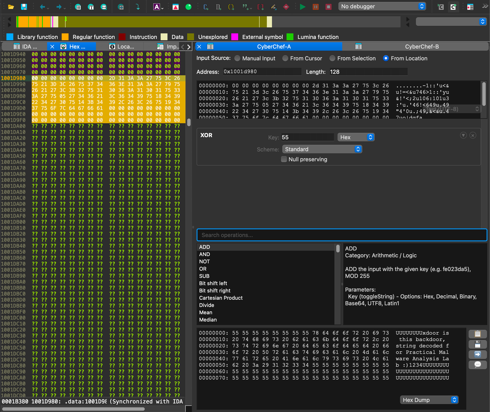

# IDA CyberChef

A Qt-based CyberChef interface designed for malware analysis workflows, particularly in IDA Pro. This brings the power of [CyberChef](https://gchq.github.io/CyberChef/)'s data transformation operations directly into your reverse engineering toolkit.

**Install it** via Hex-Rays' IDA Pro plugin manager:

```console
hcli plugin install ida-cyberchef
```

[HCLI](https://hcli.docs.hex-rays.com) is the official Hex-Rays tool for managing IDA Pro installations, licenses, and SDKs.




## What is this?

If you've ever been knee-deep in a malware sample and needed to quickly decode some base64, XOR a blob with a key, or chain together a series of transformations on binary data - you know the pain of context switching. Copy data from IDA, paste into CyberChef web UI, get result, copy back. Repeat 47 times.

This project eliminates that workflow. It embeds CyberChef's JavaScript engine directly into IDA Pro's Qt user interface, integrating with common IDA features, like reading the current cursor/selection, settings comments, and patching bytes.

## How it works

We use [STPyV8](https://github.com/area1/stpyv8) to run CyberChef's JavaScript code inside Python. The `ida_cyberchef.cyberchef` module loads CyberChef's bundle, sets up polyfills for browser/Node.js APIs it expects, and exposes a clean `bake()` function that takes binary data and a recipe.

Then, we have a PySide6 Qt widget that exposes the recipe composer with the input/output hex dumps. The UI updates reactively - change the input or tweak an operation argument, and after a brief debounce, the entire pipeline re-executes and updates the output.

As a minor extension beyond traditional CyberChef, each operation step can be expanded to preview intermediate results, which might be useful for debugging complex recipes.

## Background

This started as an experiment to see if CyberChef could be embedded in Python without needing a browser or Electron. The GCHQ team built CyberChef as a web application, but they also exposed a Node.js API. We're using a minimal CommonJS-compatible build (from Willi Ballenthin's fork) that doesn't require the full Node.js runtime.

The project went through a few iterations:
1. First, just getting the JavaScript engine to work with proper type conversions between Python bytes and CyberChef's "Dish" objects
2. Then building a clean `bake()` API that chains operations
3. Then the Qt layer with reactive execution

There's also a standalone (non-IDA Pro) Qt application for running CyberChef on the desktop; but really, I'm not sure why you'd use this versus the standalone HTML file from upstream.

## Building

First, initialize the submodule if you haven't already:

```bash
git submodule update --init --recursive
```

Then build CyberChef's JavaScript bundle (you'll need Node.js for this):

```bash
just build
```

This installs npm dependencies in the CyberChef submodule, runs the Node.js build (takes about 40 seconds), and copies the resulting bundle to `ida_cyberchef/data/CyberChef.js`. That's the ~20MB file the Python code loads at runtime.

To run the plugin in IDA, symlink the development directory into `$IDAUSR/plugins/ida-cyberchef`:

```
ln -s (pwd) ~/.idapro/plugins/ida-cyberchef
```

You'll also want to install the dependencies into your IDA Pro Python virtual environment, something like:

```
~/.idapro/venv/bin/python -m pip install STPyV8 pydantic
```

Also, you can run the standalone QApplication (outside of IDA Pro) like this:

```bash
uv run cyberchef-qt
```

## Future Work

I'm not quite sure if this will survive or not - I started out to prove this could work, and then was surprised when things fell into place. The architecture is a little ugly: running V8 from Python inside IDA to load a huge blob from GCHQ. But, it works, and we benefit from the operations already supported by CyberChef. So, if you want to propose enhancements and bug fixes, go for it!

There's some risk that the underlying Javascript engine (STPyV8, though I also worked with PythonMonkey) might become unmaintained or not build/work with future versions of Python or IDA Pro. That'll be a good time to re-evaluate the best parts of ida-cyberchef and perhaps rebuild them carefully.

## License

This project's code is licensed Apache 2.0 by Hex-Rays. CyberChef itself is also licensed under Apache 2.0 by GCHQ.
